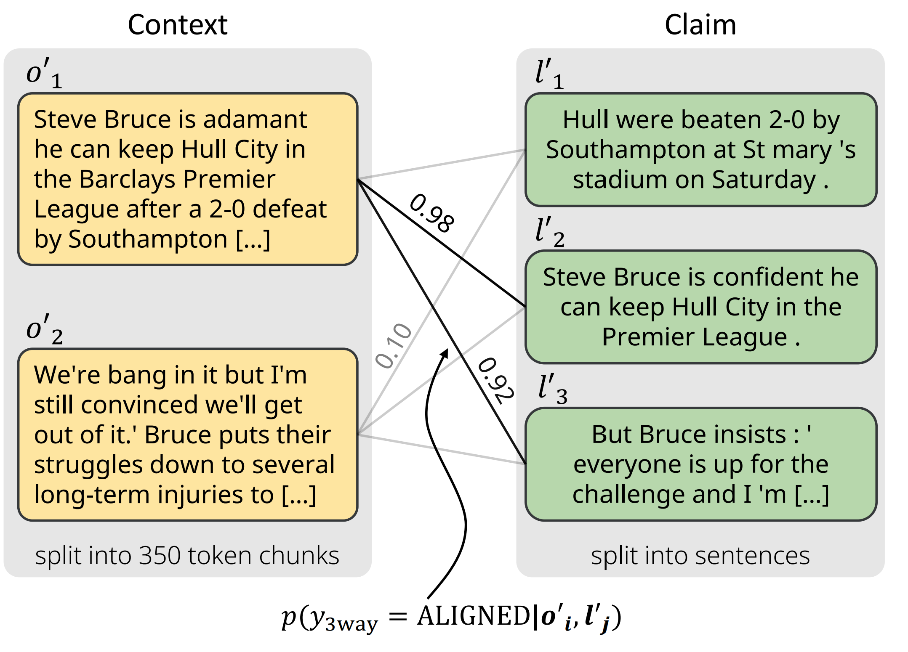

# AlignScore
This is the repository for AlignScore, a metric for automatic factual consistency evaluation of text pairs introduced in \
[AlignScore: Evaluating Factual Consistency with a Unified Alignment Function](https://arxiv.org/abs/2305.16739) \
Yuheng Zha, Yichi Yang, Ruichen Li and Zhiting Hu \
ACL 2023

**Facutual consistency evaluation** is to evaluate whether all the information in **b** is contained in **a** (**b** does not contradict **a**). For example, this is a factual inconsistent case:

* **a**: Children smiling and waving at camera.
* **b**: The kids are frowning.

And this is a factual consistent case:

* **a**: The NBA season of 1975 -- 76 was the 30th season of the National Basketball Association.
* **b**: The 1975 -- 76 season of the National Basketball Association was the 30th season of the NBA.

Factual consistency evaluation can be applied to many tasks like Summarization, Paraphrase and Dialog. For example, large language models often generate hallucinations when summarizing documents. We wonder if the generated text is factual consistent to its original context.

# Leaderboards
We introduce two leaderboards that compare AlignScore with similar-sized metrics and LLM-based metrics, respectively.
## Leaderboard --- compare with similar-sized metrics

We list the performance of AlignScore as well as other metrics on the SummaC (includes 6 datasets) and TRUE (includes 11 datasets) benchmarks, as well as other popular factual consistency datasets (include 6 datasets). 

| Rank | Metrics          | SummaC* | TRUE** | Other Datasets*** | Average**** | Paper | Code |
| ---- | :--------------- | :-----: | :----: | :------------: | :-----: | :---: | :--: |
| 1    | **AlignScore-large** |  88.6   |  83.8  |      49.3      |  73.9   |   [:page\_facing\_up:(Zha et al.  2023)](https://arxiv.org/pdf/2305.16739.pdf)   |  [:octocat:](https://github.com/yuh-zha/AlignScore)  |
| 2    | **AlignScore-base**  |  87.4   |  82.5  |      44.9      |  71.6   |   [:page\_facing\_up:(Zha et al.  2023)](https://arxiv.org/pdf/2305.16739.pdf)   |  [:octocat:](https://github.com/yuh-zha/AlignScore)  |
| 3    | QAFactEval       |  83.8   |  79.4  |      42.4      |  68.5   | [:page\_facing\_up:(Fabbri et al. 2022)](https://arxiv.org/abs/2112.08542) | [:octocat:](https://github.com/salesforce/QAFactEval) |
| 4    | UniEval          |  84.6   |  78.0  |      41.5      |  68.0   | [:page\_facing\_up:(Zhong et al. 2022)](https://arxiv.org/abs/2210.07197) | [:octocat:](https://github.com/maszhongming/UniEval) |
| 5    | SummaC-CONV      |  81.0   |  78.7  |      34.2      |  64.6   | [:page\_facing\_up:(Laban et al. 2022)](https://arxiv.org/abs/2111.09525) | [:octocat:](https://github.com/tingofurro/summac) |
| 6    | BARTScore        |  80.9   |  73.4  |      34.8      |  63.0   | [:page\_facing\_up:(Yuan et al. 2022)](https://arxiv.org/abs/2106.11520) | [:octocat:](https://github.com/neulab/BARTScore) |
| 7    | CTC              |  81.2   |  72.4  |      35.3      |  63.0   | [:page\_facing\_up:(Deng et al. 2022)](https://arxiv.org/abs/2109.06379) | [:octocat:](https://github.com/tanyuqian/ctc-gen-eval) |
| 8    | SummaC-ZS        |  79.0   |  78.2  |      30.4      |  62.5   | [:page\_facing\_up:(Laban et al. 2022)](https://arxiv.org/abs/2111.09525) | [:octocat:](https://github.com/tingofurro/summac) |
| 9    | ROUGE-2          |  78.1   |  72.4  |      27.9      |  59.5   | [:page\_facing\_up:(Lin 2004)](https://aclanthology.org/W04-1013/) | [:octocat:](https://github.com/pltrdy/rouge) |
| 10   | ROUGE-1          |  77.4   |  72.0  |      28.6      |  59.3   | [:page\_facing\_up:(Lin 2004)](https://aclanthology.org/W04-1013/) | [:octocat:](https://github.com/pltrdy/rouge) |
| 11   | ROUGE-L          |  77.3   |  71.8  |      28.3      |  59.1   | [:page\_facing\_up:(Lin 2004)](https://aclanthology.org/W04-1013/) | [:octocat:](https://github.com/pltrdy/rouge) |
| 12   | QuestEval        |  72.5   |  71.4  |      25.0      |  56.3   | [:page\_facing\_up:(Scialom et al. 2021)](https://arxiv.org/abs/2103.12693) | [:octocat:](https://github.com/ThomasScialom/QuestEval) |
| 13   | BLEU             |  76.3   |  67.3  |      24.6      |  56.1   | [:page\_facing\_up:(Papineni et al. 2002)](https://aclanthology.org/P02-1040/) | [:octocat:](https://www.nltk.org/_modules/nltk/translate/bleu_score.html) |
| 14   | DAE              |  66.8   |  65.7  |      35.1      |  55.8   | [:page\_facing\_up:(Goyal and Durrett 2020)](https://aclanthology.org/2020.findings-emnlp.322/) | [:octocat:](https://github.com/tagoyal/dae-factuality) |
| 15   | BLEURT           |  69.2   |  71.9  |      24.9      |  55.4   | [:page\_facing\_up:(Sellam et al. 2020)](https://arxiv.org/abs/2004.04696) | [:octocat:](https://github.com/google-research/bleurt) |
| 16   | BERTScore        |  72.1   |  68.6  |      21.9      |  54.2   | [:page\_facing\_up:(Zhang et al. 2020)](https://arxiv.org/abs/1904.09675) | [:octocat:](https://github.com/Tiiiger/bert_score) |
| 17   | SimCSE           |  67.4   |  70.3  |      23.8      |  53.8   | [:page\_facing\_up:(Gao et al. 2021)](https://arxiv.org/abs/2104.08821) | [:octocat:](https://github.com/princeton-nlp/SimCSE) |
| 18   | FactCC           |  68.8   |  62.7  |      21.2      |  50.9   | [:page\_facing\_up:(Kryscinski et al. 2020)](https://arxiv.org/abs/1910.12840) | [:octocat:](https://github.com/salesforce/factCC) |
| 19   | BLANC            |  65.1   |  64.0  |      14.4      |  47.8   | [:page\_facing\_up:(Vasilyev et al. 2020)](https://arxiv.org/abs/2002.09836) | [:octocat:](https://github.com/PrimerAI/blanc) |
| 20   | NER-Overlap      |  60.4   |  59.3  |      18.9      |  46.2   | [:page\_facing\_up:(Laban et al. 2022)](https://arxiv.org/abs/2111.09525) | [:octocat:](https://github.com/tingofurro/summac) |
| 21   | MNLI             |  47.9   |  60.4  |      3.1       |  37.2   | [:page\_facing\_up:(Williams et al. 2018)](https://arxiv.org/abs/1704.05426) | [:octocat:](https://github.com/nyu-mll/multiNLI) |
| 22   | FEQA             |  48.3   |  52.2  |      -1.9      |  32.9   | [:page\_facing\_up:(Durmus et al. 2020)](https://arxiv.org/abs/2005.03754) | [:octocat:](https://github.com/esdurmus/feqa) |

\*  SummaC Benchmark: [\[Paper\]](https://arxiv.org/abs/2111.09525) \| [\[Github\]](https://github.com/tingofurro/summac). We report AUC ROC on the SummaC benchmark.

** TRUE Benchmark: [\[Paper\]](https://arxiv.org/abs/2204.04991) \| [\[Github\]](https://github.com/google-research/true). We report AUC ROC on the TRUE benchmark.

*** Besides the SummaC and TRUE benchmarks, we also include other popular factual consistency evaluation datasets: [XSumFaith](https://doi.org/10.18653/v1/2020.acl-main.173), [SummEval](https://doi.org/10.1162/tacl_a_00373), [QAGS-XSum](https://doi.org/10.18653/v1/2020.acl-main.450), [QAGS-CNNDM](https://doi.org/10.18653/v1/2020.acl-main.450), [FRANK-XSum](https://doi.org/10.18653/v1/2021.naacl-main.383), [FRANK-CNNDM](https://doi.org/10.18653/v1/2021.naacl-main.383) and [SamSum](https://doi.org/10.18653/v1/D19-5409). We compute the Spearman Correlation coefficients between the human annotated score and the metric predicted score, following common practice. 

**** To rank these metrics, we simply compute the average performance of SummaC, TRUE and Other Datasets.

## Leaderboard --- compare with LLM-based metrics

We also show the performance comparison with large-language-model based metrics below. The rank is based on the average Spearman Correlation coefficients on SummEval, QAGS-XSum and QAGS-CNNDM datasets.*

| Rank | Metrics               | Base Model                                                   | SummEval | QAGS-XSUM | QAGS-CNNDM | Average |                            Paper                             |                             Code                             |
| :--- | :-------------------- | :----------------------------------------------------------- | :------: | :-------: | :--------: | :--: | :----------------------------------------------------------: | :----------------------------------------------------------: |
| 1    | **AlignScore-large**     | RoBERTa-l (355M)                                             |   46.6   |   57.2    |    73.9    | 59.3 | [:page\_facing\_up:(Zha et al.  2023)](https://arxiv.org/pdf/2305.16739.pdf) |      [:octocat:](https://github.com/yuh-zha/AlignScore)      |
| 2    | G-EVAL-4              | GPT4                                                         |   50.7   |   53.7    |    68.5    | 57.6 | [:page\_facing\_up:(Liu et al.  2023)](https://arxiv.org/pdf/2303.16634.pdf) |        [:octocat:](https://github.com/nlpyang/geval)         |
| 3    | **AlignScore-base**       | RoBERTa-b (125M)                                             |   43.4   |   51.9    |    69.0    | 54.8 | [:page\_facing\_up:(Zha et al.  2023)](https://arxiv.org/pdf/2305.16739.pdf) |      [:octocat:](https://github.com/yuh-zha/AlignScore)      |
| 4    | FActScore (modified)** | GPT3.5-d03 + GPT3.5-turbo |   52.6   |   51.2    |    57.6    | 53.8 | [:page\_facing\_up:(Min et al.   2023)](https://arxiv.org/pdf/2305.14251.pdf) |      [:octocat:](https://github.com/shmsw25/FActScore)*      |
| 5    | ChatGPT (Chen et al. 2023) | GPT3.5-turbo                                                 |   42.7   |   53.3    |    52.7    | 49.6 | [:page\_facing\_up:(Yi Chen et al.  2023)](https://arxiv.org/pdf/2305.14069.pdf) | [:octocat:](https://github.com/SJTU-LIT/llmeval_sum_factual) |
| 6    | GPTScore              | GPT3.5-d03                                                   |   45.9   |   22.7    |    64.4    | 44.3 | [:page\_facing\_up:(Fu et al.  2023)](https://arxiv.org/pdf/2302.04166.pdf) |      [:octocat:](https://github.com/jinlanfu/GPTScore)       |
| 7    | GPTScore              | GPT3-d01                                                     |   46.1   |   22.3    |    63.9    | 44.1 | [:page\_facing\_up:(Fu et al.  2023)](https://arxiv.org/pdf/2302.04166.pdf) |      [:octocat:](https://github.com/jinlanfu/GPTScore)       |
| 8    | G-EVAL-3.5            | GPT3.5-d03                                                   |   38.6   |   40.6    |    51.6    | 43.6 | [:page\_facing\_up:(Liu et al.  2023)](https://arxiv.org/pdf/2303.16634.pdf) |        [:octocat:](https://github.com/nlpyang/geval)         |
| 9    | ChatGPT (Gao et al. 2023) | GPT3.5-turbo                                                 |   41.6   |   30.4    |    48.9    | 40.3 | [:page\_facing\_up:(Gao et al.  2023)](https://arxiv.org/pdf/2304.02554.pdf) |                              -                               |

\* We notice that evaluating factual consistency using GPT-based models is expensive and slow. And we need human labor to interpret the response (generally text) to numerical scores. Therefore, we only benchmark on 3 popular factual consistency evaluation datasets: SummEval, QAGS-XSum and QAGS-CNNDM.

*\* We use a modified version of FActScore `retrieval+ChatGPT` where we skip the retrieval stage and use the context documents in SummEval, QAGS-XSUM, and QAGS-CNNDM directly. As samples in theses datasets do not have "topics", we make a small modification to the original FActScore prompt and do not mention `topic` when not available. See [our fork of FActScore](https://github.com/yichi-yang/FActScore) for more details.

# Introduction

The AlignScore metric is an automatic factual consistency evaluation metric built with the following parts:

* Unified information alignment function between two arbitrary text pieces: It is trained on 4.7 million training examples from 7 well-established tasks (NLI, QA, paraphrasing, fact verification, information retrieval, semantic textual similarity and summarization) 

* The chunk-sentence splitting method: The input context is splitted into chunks (contains roughly 350 tokens each) and the input claim is splitted into sentences. With the help of the alignment function, it's possible to know the alignment score between chunks and sentences. We pick the maximum alignment score for each sentence and then average these scores to get the example-level factual consistency score (AlignScore).

  <div align=center>
  
  </div>

We assume there are two inputs to the metric, namely `context` and `claim`. And the metric evaluates whether the `claim` is factual consistent with the `context`. The output of AlignScore is a single numerical value, which shows the degree of the factual consistency.
# Installation

Our models are trained and evaluated using PyTorch 1.12.1. We recommend using this version to reproduce the results.

1. Please first install the right version of PyTorch before installing `alignscore`.
2. You can install `alignscore` by cloning this repository and `pip install .`.
3. After installing `alignscore`, please use `python -m spacy download en_core_web_sm` to install the required spaCy model (we use `spaCy` for sentenization).

# Evaluating Factual Consistency
To evaluate the factual consistency of the `claim` w.r.t. the `context`, simply use the score method of `AlignScore`.
```python
from alignscore import AlignScore

scorer = AlignScore(model='roberta-base', batch_size=32, device='cuda:0', ckpt_path='/path/to/checkpoint', evaluation_mode='nli_sp')
score = scorer.score(contexts=['hello world.'], claims=['hello world.'])
```
`model`: the backbone model of the metric. Now, we only provide the metric trained on RoBERTa

`batch_size`: the batch size of the inference

`device`: which device to run the metric

`ckpt_path`: the path to the checkpoint

`evaluation_mode`: choose from `'nli_sp', 'nli', 'bin_sp', 'bin'`. `nli` and `bin` refer to the 3-way and binary classficiation head, respectively. `sp` indicates if the chunk-sentence splitting method is used. `nli_sp` is the default setting of AlignScore


# Checkpoints
We provide two versions of the AlignScore checkpoints: `AlignScore-base` and `AlignScore-large`. The `-base` model is based on RoBERTa-base and has 125M parameters. The `-large` model is based on RoBERTa-large and has 355M parameters. 

**AlignScore-base**: 
https://huggingface.co/yzha/AlignScore/resolve/main/AlignScore-base.ckpt

**AlignScore-large**:
https://huggingface.co/yzha/AlignScore/resolve/main/AlignScore-large.ckpt

# Training  
You can use the above checkpoints directly for factual consistency evaluation. However, if you wish to train an alignment model from scratch / on your own data, use `train.py`.
```python
python train.py --seed 2022 --batch-size 32 \
--num-epoch 3 --devices 0 1 2 3 \
--model-name roberta-large -- ckpt-save-path ./ckpt/ \
--data-path ./data/training_sets/ \
--max-samples-per-dataset 500000
```

`--seed`: the random seed for initialization

`--batch-size`: the batch size for training

`--num-epoch`: training epochs

`--devices`: which devices to train the metric, a list of GPU ids

`--model-name`: the backbone model name of the metric, default RoBERTa-large

`--ckpt-save-path`: the path to save the checkpoint

`--training-datasets`: the names of the training datasets

`--data-path`: the path to the training datasets

`--max-samples-per-dataset`: the maximum number of samples from a dataset

# Benchmarking
Our benchmark includes the TRUE and SummaC benchmark as well as several popular factual consistency evaluation datasets.

To run the benchmark, a few additional dependencies are required and can be installed with `pip install -r requirements.txt`.
Additionally, some depedencies are not available as packages and need to be downloaded manually (please see `python benchmark.py --help` for instructions).

Note installing `summac` may cause dependency conflicts with `alignscore`. Please reinstall `alignscore` to force the correct dependency versions.

The relevant arguments for evaluating AlignScore are:

`--alignscore`: evaluation the AlignScore metric

`--alignscore-model`: the name of the backbone model (either 'roberta-base' or 'roberta-large')

`--alignscore-ckpt`: the path to the saved checkpoint

`--alignscore-eval-mode`: the evaluation mode, defaults to `nli_sp`

`--device`: which device to run the metric, defaults to `cuda:0`

`--tasks`: which tasks to benchmark, e.g., SummEval, QAGS-CNNDM, ...

For the baselines, please see `python benchmark.py --help` for details.

## Evaluation datasets download

The following table shows the links to the evaluation datasets mentioned in the paper

| Benchmark/Dataset | Link                                                         |
| ----------------- | ------------------------------------------------------------ |
| SummaC            | https://github.com/tingofurro/summac                         |
| TRUE              | https://github.com/google-research/true                      |
| XSumFaith         | https://github.com/google-research-datasets/xsum_hallucination_annotations |
| SummEval          | https://github.com/tanyuqian/ctc-gen-eval/blob/master/train/data/summeval.json |
| QAGS-Xsum         | https://github.com/tanyuqian/ctc-gen-eval/blob/master/train/data/qags_xsum.json |
| QAGS-CNNDM        | https://github.com/tanyuqian/ctc-gen-eval/blob/master/train/data/qags_cnndm.json |
| FRANK-XSum        | https://github.com/artidoro/frank                            |
| FRANK-CNNDM       | https://github.com/artidoro/frank                            |
| SamSum            | https://github.com/skgabriel/GoFigure/blob/main/human_eval/samsum.jsonl |

# Citation
If you find the metric and this repo helpful, please consider cite:
```
@inproceedings{zha-etal-2023-alignscore,
    title = "{A}lign{S}core: Evaluating Factual Consistency with A Unified Alignment Function",
    author = "Zha, Yuheng  and
      Yang, Yichi  and
      Li, Ruichen  and
      Hu, Zhiting",
    booktitle = "Proceedings of the 61st Annual Meeting of the Association for Computational Linguistics (Volume 1: Long Papers)",
    month = jul,
    year = "2023",
    address = "Toronto, Canada",
    publisher = "Association for Computational Linguistics",
    url = "https://aclanthology.org/2023.acl-long.634",
    pages = "11328--11348",
    abstract = "Many text generation applications require the generated text to be factually consistent with input information. Automatic evaluation of factual consistency is challenging. Previous work has developed various metrics that often depend on specific functions, such as natural language inference (NLI) or question answering (QA), trained on limited data. Those metrics thus can hardly assess diverse factual inconsistencies (e.g., contradictions, hallucinations) that occur in varying inputs/outputs (e.g., sentences, documents) from different tasks. In this paper, we propose AlignScore, a new holistic metric that applies to a variety of factual inconsistency scenarios as above. AlignScore is based on a general function of information alignment between two arbitrary text pieces. Crucially, we develop a unified training framework of the alignment function by integrating a large diversity of data sources, resulting in 4.7M training examples from 7 well-established tasks (NLI, QA, paraphrasing, fact verification, information retrieval, semantic similarity, and summarization). We conduct extensive experiments on large-scale benchmarks including 22 evaluation datasets, where 19 of the datasets were never seen in the alignment training. AlignScore achieves substantial improvement over a wide range of previous metrics. Moreover, AlignScore (355M parameters) matches or even outperforms metrics based on ChatGPT and GPT-4 that are orders of magnitude larger.",
}
```
